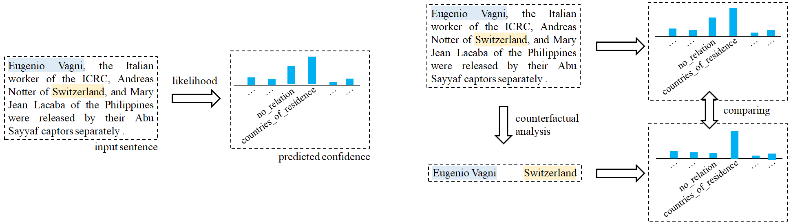

# Should We Rely on Entity Mentions for Relation Extraction? Debiasing Relation Extraction with Counterfactual Analysis

## Introduction

This is an implementation for our paper titled [Should We Rely on Entity Mentions for Relation Extraction? Debiasing Relation Extraction with Counterfactual Analysis](https://aclanthology.org/2022.naacl-main.224.pdf) based on Pytorch.

An Example of Mitigating Entity Bias through Counterfactual Analysis|
:-------------------------:|
  |

## Running the experiments

### Requirements

Dependencies (with python == 3.8.2):

```{bash}
torch==1.8.1+cu102
transformers==4.7.0
numpy==1.18.1
joblib==1.1.0
```

### Data Preparation
The necessary data has been provided in the folder already. The 'test.json' file includes the test set of TACRED.

### Running
```{bash}
python core.py
```

## License
MIT